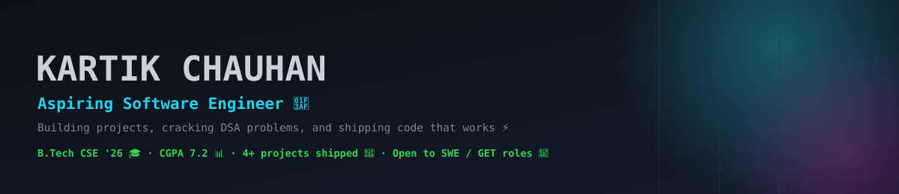

<picture>
  <source media="(prefers-color-scheme: dark)" srcset="assets/hero-dark.svg">
  <source media="(prefers-color-scheme: light)" srcset="assets/hero-light.svg">
  
</picture>

**Kartik Chauhan**, Aspiring Software Engineer (in case the fancy banner above didn't load, hi 👋)

## About me

I'm a final-year B.Tech CSE grad (2026, CGPA 7.2) currently applying to Software Engineer and Graduate Engineer Trainee roles. I like taking DSA problems apart until they actually make sense, building small full-stack projects end-to-end just to see how the pieces fit together, and right now I'm deep in interview prep — DBMS, OS, and a lot of C++ 🧠

<picture>
  <source media="(prefers-color-scheme: dark)" srcset="assets/signature-card-dark.svg">
  <source media="(prefers-color-scheme: light)" srcset="assets/signature-card-light.svg">
  
</picture>

## My stack 🧰

  
  
  
  
  
  
  
  
  
  
  
  
  
  

Also studying: DSA · AI/ML · Computer Networks · Operating Systems · DBMS

## The numbers GitHub tracks 📈

  

  
  

  

<picture>
  <source media="(prefers-color-scheme: dark)" srcset="https://raw.githubusercontent.com/Kcrage/Kcrage/output/snake-dark.svg">
  <source media="(prefers-color-scheme: light)" srcset="https://raw.githubusercontent.com/Kcrage/Kcrage/output/snake-light.svg">
  
</picture>

## What I've been building 🚀

| Project | What it is | Status | Stack |
|---|---|---|---|
| DSA Buddy | Chrome extension AI tutor that gives contextual hints while solving LeetCode problems instead of just handing over the answer | 🛠️ In progress | Vibe-coded, LeetCode integration |
| Movie Recommendation System | Content-based recommender using TF-IDF + cosine similarity on the TMDB dataset, with a Streamlit front end | ✅ Complete | Python, Streamlit, TMDB API |
| Image Caption Sharing App | Full CRUD REST API with auth and image uploads (Multer + ImageKit) | ✅ Complete | Node.js, Express, MongoDB |
| CPU Scheduling Simulator | Desktop visualizer for FCFS / SJF / Priority / Round Robin scheduling, built with the Template Method pattern | ✅ Complete | Java, Swing |

📚 What I'm sharpening right now

 

- DSA in C++ — two-pointer, sliding window, prefix sum, hashmaps
- Core CS: DBMS (normalization, indexing, transactions), OS (deadlock, scheduling, memory management), Computer Networks
- AI/ML fundamentals

## Let's talk 👋

  
  
  
  

<i>kcrage@dev:~$ echo "thanks for scrolling this far 🫡"</i>

